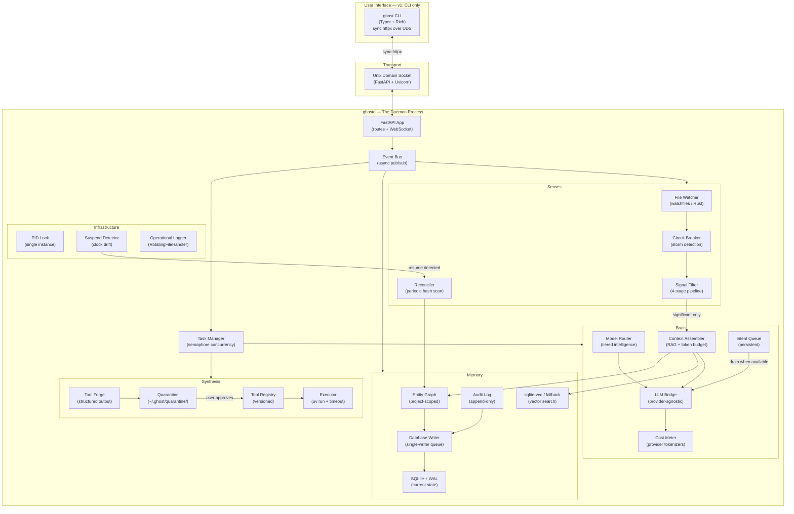

# Ghost v3.0 — FINAL Implementation Plan

> **The AI daemon that haunts your machine.**
> A local-first, self-extending AI agent that runs as a background process, maintains persistent memory, synthesizes its own tools, watches your workflows, and surfaces insights proactively.

---

## Review History

This plan survived **4 rounds of adversarial design review** identifying **36 architectural gaps**. Every gap has a documented resolution. No open questions remain.

### Review Timeline

| Round | Gaps Found | Key Corrections |
|-------|-----------|----------------|
| v1.0 → v2.0 | 7 | AST sandbox dropped, FastAPI replaces custom IPC, sqlite-vec, watchfiles, DB-as-state |
| Blind spots | 6 | Context assembly, cost meter, cold start, prompt versioning, intent queue, upgrade migrations |
| Final gaps | 10 | PID file, PEP 723, structured output, multi-project, operational logging, suspend detection, corruption recovery, uninstall, Windows scope, concurrency |
| User warnings | 3 | SQLite write serialization, provider-specific tokenizer, stale socket cleanup |
| Additional | 10 | Circuit breaker, rate limit backoff, mega-file truncation, tool env deps, tool versioning, exclusion zones, triage policy, sqlite-vec fallback, cold start tiered indexing |

---

## 1. Architecture



### Data Flow: Tool Synthesis Request

```
1. User: `ghost forge "find all TODO comments with priority tags"`

2. CLI → httpx.Client(transport=HTTPTransport(uds="~/.ghost/ghost.sock"))
   → POST /api/forge {intent: "...", project_id: "..."}

3. FastAPI route → event_bus.publish("forge.requested", {...})

4. TaskManager acquires LLM semaphore (max 2 concurrent LLM calls)

5. Context Assembler:
   a. Queries Entity Graph for project-scoped context
   b. Queries sqlite-vec for semantically similar entities
   c. Merges via Reciprocal Rank Fusion
   d. Packs into token budget using PROVIDER-SPECIFIC tokenizer
      - OpenAI: tiktoken (local, fast)
      - Anthropic: client.messages.count_tokens() (API call)
      - Google: model.count_tokens() (API call)
      - Fallback: len(text) / 4 (rough approximation)

6. Model Router selects Tier 2 model

7. LLM Bridge calls provider with STRUCTURED OUTPUT:
   - OpenAI: response_format={type:"json_schema", strict:true}
   - Anthropic: tool_use with a "generate_tool" function schema
   - Google: response_mime_type="application/json" + response_schema
   → Response validated against Pydantic ToolSynthesisResponse model

8. Cost Meter logs: {model, input_tokens, output_tokens, cost_usd, purpose}

9. Tool Forge writes script with PEP 723 header to quarantine:
   ~/.ghost/quarantine/todo_finder_a3f8.py

10. CLI displays generated code with Rich syntax highlighting
    Prompts: "Approve and execute? [y/n/edit]"

11. User approves → TaskManager acquires exec semaphore (max 1 concurrent)

12. Executor runs: `uv run ~/.ghost/quarantine/todo_finder_a3f8.py`
    - uv reads PEP 723 metadata, creates temp venv, installs deps
    - subprocess limits: 30s timeout, 256MB memory
    - If uv not found: fallback to `python` with warning

13. Output captured → displayed to user

14. DatabaseWriter queue receives:
    a. Tool registration (name, hash, prompt_version, capabilities)
    b. Entity graph update (new Tool entity linked to Project)
    c. Audit log entry

15. All writes execute sequentially in single writer coroutine → no lock contention
```

---

## 2. Technology Stack (Final)

```toml
[project]
name = "ghost-ai"
version = "0.1.0"
requires-python = ">=3.11"
license = "MIT"

dependencies = [
    "typer>=0.9",              # CLI framework
    "rich>=13.0",              # Terminal UI
    "fastapi>=0.115",          # Daemon API server
    "uvicorn[standard]>=0.30", # ASGI server (UDS support)
    "aiosqlite>=0.20",         # Async SQLite
    "watchfiles>=1.0",         # Filesystem watcher (Rust-based)
    "httpx>=0.27",             # HTTP client (LLM APIs + CLI→daemon UDS)
    "pydantic>=2.0",           # Validation + config
    "tiktoken>=0.7",           # OpenAI tokenizer (also used as fallback)
    "tenacity>=8.0",           # Retry with exponential backoff for API calls
    "tomli>=2.0;python_version<'3.12'",
    "tomli-w>=1.0",            # TOML writing
]

[project.optional-dependencies]
vectors = ["sqlite-vec>=0.1"]  # Optional: C extension may not compile everywhere
anthropic = ["anthropic>=0.30"]
google = ["google-generativeai>=0.7"]
embeddings = ["sentence-transformers>=3.0"]
dev = [
    "pytest>=8.0",
    "pytest-asyncio>=0.23",
    "pytest-cov>=5.0",
    "ruff>=0.5",
    "mypy>=1.10",
    "respx>=0.21",
]

[project.scripts]
ghost = "ghost.cli.app:main"
ghostd = "ghost.core.daemon:main"
```

### Dependency Changes From v2.0

| Change | Reason |
|--------|--------|
| `tiktoken` added to core deps | Provider-specific token counting (Warning 3). Used for OpenAI and as universal fallback. |
| `tenacity` added to core deps | Exponential backoff + jitter for 429 rate limits. Not reinventing retry logic. |
| `sqlite-vec` moved to optional | C extension compilation is the #1 install failure risk. Ghost boots without it; vector search degrades to FTS5-only. |
| `openai` removed from optional | We use `httpx` directly with structured output. No SDK dependency = fewer transitive deps. |

---

## 3. Project Structure

```
ghost/
├── README.md
├── LICENSE                         # MIT
├── pyproject.toml
├── Makefile                        # make dev, test, lint, run
├── .github/
│   └── workflows/
│       ├── ci.yml                  # Lint + unit tests on push
│       └── release.yml             # PyPI publish on tag
│
├── src/
│   └── ghost/
│       ├── __init__.py             # __version__
│       ├── __main__.py             # python -m ghost
│       ├── constants.py            # Paths, defaults, version
│       │
│       ├── config/
│       │   ├── __init__.py
│       │   ├── schema.py           # Pydantic config models
│       │   ├── loader.py           # TOML + env vars → GhostConfig
│       │   └── migrations.py       # Config version transforms
│       │
│       ├── core/
│       │   ├── __init__.py
│       │   ├── daemon.py           # Daemon entry: PID lock, uvicorn launch
│       │   ├── app.py              # FastAPI app factory
│       │   ├── events.py           # EventBus pub/sub
│       │   ├── tasks.py            # TaskManager: semaphore concurrency control
│       │   ├── lifecycle.py        # Signal handling, graceful shutdown, cleanup
│       │   ├── health.py           # Health endpoint + suspend detection
│       │   └── logging.py          # Operational logger setup (RotatingFileHandler)
│       │
│       ├── brain/
│       │   ├── __init__.py
│       │   ├── providers/
│       │   │   ├── __init__.py
│       │   │   ├── base.py         # Protocol: complete(), structured_complete(),
│       │   │   │                    #   count_tokens(), embed()
│       │   │   ├── openai.py       # OpenAI (httpx + structured output)
│       │   │   ├── anthropic.py    # Anthropic (tool_use for structured output)
│       │   │   └── google.py       # Gemini (response_schema)
│       │   ├── router.py           # Tiered model selection
│       │   ├── context.py          # Context Assembly Pipeline (RAG)
│       │   ├── cost.py             # Cost meter + provider-specific tokenizer
│       │   ├── queue.py            # Intent queue (LLM unavailability)
│       │   ├── retry.py            # Tenacity retry policies (429 backoff)
│       │   └── prompts/
│       │       ├── __init__.py
│       │       ├── registry.py     # Prompt version management
│       │       └── v1/
│       │           ├── forge.py    # Tool synthesis prompt
│       │           ├── triage.py   # Event significance scoring
│       │           └── analyze.py  # General analysis
│       │
│       ├── memory/
│       │   ├── __init__.py
│       │   ├── database.py         # Connection management, pragma tuning
│       │   ├── writer.py           # DatabaseWriter: single-writer queue (Warning 2)
│       │   ├── migrations/
│       │   │   ├── __init__.py
│       │   │   ├── runner.py       # Schema version check + migration
│       │   │   ├── 001_initial.sql
│       │   │   └── 002_vectors.sql
│       │   ├── entities.py         # Entity CRUD (project-scoped)
│       │   ├── graph.py            # Edge CRUD, traversal
│       │   ├── vectors.py          # sqlite-vec with graceful fallback
│       │   ├── search.py           # Unified search: FTS5 + graph + vectors
│       │   └── audit.py            # Append-only event log
│       │
│       ├── synthesis/
│       │   ├── __init__.py
│       │   ├── forge.py            # Intent → structured LLM → quarantine
│       │   ├── quarantine.py       # File management, pending approvals
│       │   ├── executor.py         # uv run / python subprocess (PEP 723)
│       │   ├── registry.py         # Tool manifest + versioning
│       │   └── templates/
│       │       └── tool_skeleton.py # PEP 723 template
│       │
│       ├── senses/
│       │   ├── __init__.py
│       │   ├── watcher.py          # watchfiles integration
│       │   ├── filters.py          # .ghostignore, debounce, scoring
│       │   ├── circuit_breaker.py  # Storm detection (>50 events in 3s)
│       │   ├── reconciler.py       # Periodic hash scan
│       │   └── pipeline.py         # Full event processing pipeline
│       │
│       ├── cli/
│       │   ├── __init__.py
│       │   ├── app.py              # Typer app, main()
│       │   ├── client.py           # Sync httpx over UDS
│       │   ├── display.py          # Rich formatting helpers
│       │   └── commands/
│       │       ├── __init__.py
│       │       ├── init.py         # ghost init
│       │       ├── start.py        # ghost start / stop / restart / status
│       │       ├── forge.py        # ghost forge
│       │       ├── approve.py      # ghost approve / reject
│       │       ├── watch.py        # ghost watch / unwatch
│       │       ├── memory.py       # ghost memory search / stats / rebuild
│       │       ├── tools.py        # ghost tools list / info / run / delete
│       │       ├── logs.py         # ghost logs (audit)
│       │       ├── debug.py        # ghost debug (operational log)
│       │       ├── cost.py         # ghost cost
│       │       ├── doctor.py       # ghost doctor (system check)
│       │       ├── gc.py           # ghost gc (garbage collection)
│       │       └── uninstall.py    # ghost uninstall
│       │
│       └── api/
│           ├── __init__.py
│           ├── routes/
│           │   ├── __init__.py
│           │   ├── forge.py
│           │   ├── tools.py
│           │   ├── memory.py
│           │   ├── watch.py
│           │   ├── health.py
│           │   ├── events.py       # WebSocket live stream
│           │   └── config.py       # Dynamic config (log level, etc.)
│           └── schemas.py          # Pydantic request/response models
│
├── tools/                          # Pre-built starter tools
│   ├── project_scanner.py
│   ├── git_analyzer.py
│   ├── todo_finder.py
│   └── manifest.json
│
├── tests/
│   ├── conftest.py
│   ├── unit/
│   │   ├── test_events.py
│   │   ├── test_filters.py
│   │   ├── test_graph.py
│   │   ├── test_context.py
│   │   ├── test_cost.py
│   │   ├── test_quarantine.py
│   │   ├── test_registry.py
│   │   ├── test_router.py
│   │   ├── test_config.py
│   │   ├── test_writer.py          # Database writer queue
│   │   ├── test_circuit_breaker.py
│   │   └── test_suspend.py
│   ├── integration/
│   │   ├── test_daemon_lifecycle.py
│   │   ├── test_forge_flow.py
│   │   ├── test_watch_pipeline.py
│   │   └── test_reconciler.py
│   └── fixtures/
│       ├── llm_responses/
│       └── projects/
│
├── scripts/
│   ├── install.sh
│   ├── ghost.service               # systemd --user template
│   ├── ghost.plist                  # macOS launchd template
│   └── record_llm.py
│
└── docs/
    ├── architecture.md
    ├── configuration.md
    ├── extending.md
    └── contributing.md
```

**~65 files.** New additions from v2.0: `writer.py`, `tasks.py`, `circuit_breaker.py`, `retry.py`, `logging.py`, `doctor.py`, `gc.py`, `uninstall.py`, `debug.py`, `ghost.plist`.

---

## 4. Critical Module Specifications

### 4.1 Database Writer — Single-Writer Queue (Warning 2 Fix)

> [!IMPORTANT]
> This is the most important architectural addition in v3.0. Without it, SQLite throws `database is locked` under concurrent load from the Senses pipeline (writing events) and the Brain (reading context).

```python
# src/ghost/memory/writer.py
"""
Single-writer pattern for SQLite.

ALL writes to the database go through this queue.
Readers can read directly (WAL mode allows concurrent reads).
This eliminates lock contention entirely.
"""
import asyncio
from dataclasses import dataclass
from typing import Any

@dataclass
class WriteOp:
    """A single database write operation."""
    sql: str
    params: tuple[Any, ...] = ()
    future: asyncio.Future | None = None  # For callers that need the result

class DatabaseWriter:
    """
    Single async consumer that processes all DB writes sequentially.
    
    Usage:
        writer = DatabaseWriter(db)
        await writer.start()
        
        # From any module (concurrency-safe):
        await writer.write("INSERT INTO ...", (val1, val2))
        
        # Or fire-and-forget:
        writer.enqueue("INSERT INTO audit_log ...", (val1,))
    """

    def __init__(self, db):
        self.db = db
        self._queue: asyncio.Queue[WriteOp] = asyncio.Queue()
        self._running = False
        self._task: asyncio.Task | None = None

    async def start(self):
        """Start the writer consumer loop."""
        self._running = True
        self._task = asyncio.create_task(self._consumer())

    async def stop(self):
        """Drain queue and stop."""
        self._running = False
        # Signal consumer to exit
        await self._queue.put(None)
        if self._task:
            await self._task

    async def write(self, sql: str, params: tuple = ()) -> Any:
        """Write with result (awaits completion)."""
        future = asyncio.get_event_loop().create_future()
        await self._queue.put(WriteOp(sql=sql, params=params, future=future))
        return await future

    def enqueue(self, sql: str, params: tuple = ()):
        """Fire-and-forget write (no result needed)."""
        self._queue.put_nowait(WriteOp(sql=sql, params=params))

    async def _consumer(self):
        """Process writes sequentially. Never more than one write at a time."""
        while self._running or not self._queue.empty():
            op = await self._queue.get()
            if op is None:
                break
            try:
                async with self.db.execute(op.sql, op.params) as cursor:
                    result = await cursor.fetchall()
                await self.db.commit()
                if op.future:
                    op.future.set_result(result)
            except Exception as e:
                if op.future:
                    op.future.set_exception(e)
                else:
                    logger.exception(f"Write failed: {op.sql[:100]}")
```

### 4.2 Provider-Specific Tokenizer (Warning 3 Fix)

```python
# src/ghost/brain/cost.py (updated)
"""
Token counting uses the CORRECT tokenizer for each provider.
A "token" is not a universal unit — each provider tokenizes differently.
"""
import tiktoken

class TokenCounter:
    """Provider-specific token counting."""

    def __init__(self, provider_name: str, model: str, llm_client=None):
        self.provider = provider_name
        self.model = model
        self._client = llm_client  # For API-based counting

        # Pre-load tiktoken for OpenAI (offline, fast)
        if provider_name == "openai":
            try:
                self._encoding = tiktoken.encoding_for_model(model)
            except KeyError:
                self._encoding = tiktoken.get_encoding("cl100k_base")
        else:
            self._encoding = None

    def count(self, text: str) -> int:
        """Count tokens using the provider-specific tokenizer."""
        if self.provider == "openai" and self._encoding:
            return len(self._encoding.encode(text))

        if self.provider == "anthropic" and self._client:
            # Use Anthropic's API-based counting
            try:
                result = self._client.messages.count_tokens(
                    model=self.model,
                    messages=[{"role": "user", "content": text}]
                )
                return result.input_tokens
            except Exception:
                pass  # Fall through to approximation

        if self.provider == "google" and self._client:
            # Use Google's API-based counting
            try:
                result = self._client.count_tokens(text)
                return result.total_tokens
            except Exception:
                pass  # Fall through to approximation

        # Universal fallback: ~4 chars per token (rough but safe)
        # Overestimates slightly, which is safer than underestimating
        return len(text) // 3
```

### 4.3 Daemon Startup — PID Lock + Stale Socket Cleanup (Warning 1 Fix)

```python
# src/ghost/core/daemon.py
"""
Daemon entry point. Handles:
1. Single-instance enforcement via PID file
2. Stale socket cleanup
3. Uvicorn launch on Unix Domain Socket
4. Graceful shutdown via signal handlers
"""
import os
import sys
import signal
import atexit
from pathlib import Path

def ensure_single_instance(config) -> None:
    """Prevent multiple daemon instances. Clean up stale artifacts."""
    pid_file = config.ghost_home / "ghost.pid"
    sock_file = config.socket_path

    # Check if another instance is running
    if pid_file.exists():
        try:
            old_pid = int(pid_file.read_text().strip())
            os.kill(old_pid, 0)  # Signal 0 = check existence
            # Process exists — another daemon is running
            print(f"Ghost daemon already running (PID {old_pid})", file=sys.stderr)
            print(f"Run 'ghost stop' first, or 'ghost restart'.", file=sys.stderr)
            sys.exit(1)
        except (ProcessLookupError, ValueError):
            # Stale PID file — old process is dead
            pid_file.unlink(missing_ok=True)

    # Clean stale socket file (left over from crash)
    if sock_file.exists():
        sock_file.unlink()

    # Write current PID
    pid_file.write_text(str(os.getpid()))

    # Register cleanup for normal exit
    def cleanup():
        pid_file.unlink(missing_ok=True)
        sock_file.unlink(missing_ok=True)

    atexit.register(cleanup)
    signal.signal(signal.SIGTERM, lambda s, f: sys.exit(0))  # Triggers atexit
    signal.signal(signal.SIGINT, lambda s, f: sys.exit(0))


def main():
    """Entry point for `ghostd` command."""
    import uvicorn
    from ghost.config.loader import load_config
    from ghost.core.app import create_app

    config = load_config()
    config.ghost_home.mkdir(parents=True, exist_ok=True)

    # Integrity check
    from ghost.memory.database import check_integrity
    check_integrity(config.db_path)

    # Single instance guard
    ensure_single_instance(config)

    # Create FastAPI app
    app = create_app(config)

    # Launch uvicorn on Unix socket
    uvicorn.run(
        app,
        uds=str(config.socket_path),
        log_level=config.log_level.lower(),
        access_log=False,
    )
```

### 4.4 CLI Client — Sync httpx Over UDS

```python
# src/ghost/cli/client.py
"""
CLI → Daemon communication over Unix Domain Socket.
Uses SYNC httpx (NOT async) because Typer is synchronous.

Research confirmed: httpx.Client supports UDS via HTTPTransport(uds=...).
"""
import httpx
from pathlib import Path

class GhostClient:
    """Synchronous HTTP client that talks to the Ghost daemon over UDS."""

    def __init__(self, socket_path: Path):
        self.socket_path = socket_path
        self._transport = httpx.HTTPTransport(uds=str(socket_path))
        # URL host is ignored when using UDS; "ghostd" is a placeholder
        self._base_url = "http://ghostd"

    def _client(self) -> httpx.Client:
        return httpx.Client(transport=self._transport, base_url=self._base_url)

    def is_daemon_running(self) -> bool:
        """Check if the daemon is alive."""
        try:
            with self._client() as c:
                r = c.get("/api/health", timeout=2.0)
                return r.status_code == 200
        except (httpx.ConnectError, FileNotFoundError):
            return False

    def forge(self, intent: str, project_id: str | None = None) -> dict:
        with self._client() as c:
            r = c.post("/api/forge", json={"intent": intent, "project_id": project_id}, timeout=60.0)
            r.raise_for_status()
            return r.json()

    def approve_tool(self, tool_id: str) -> dict:
        with self._client() as c:
            r = c.post(f"/api/tools/{tool_id}/approve", timeout=60.0)
            r.raise_for_status()
            return r.json()

    def get_status(self) -> dict:
        with self._client() as c:
            r = c.get("/api/health", timeout=5.0)
            r.raise_for_status()
            return r.json()

    # ... additional methods for watch, memory, tools, cost, etc.
```

### 4.5 Daemon Start/Stop Protocol

```python
# src/ghost/cli/commands/start.py
"""
ghost start — Launch the daemon as a detached background process.
ghost stop  — Graceful shutdown.
"""
import subprocess
import sys
import time
import os

def start_daemon(config):
    """Start ghostd as a detached subprocess."""
    if GhostClient(config.socket_path).is_daemon_running():
        print("👻 Ghost daemon is already running")
        return

    # Find the ghostd binary
    ghostd = shutil.which("ghostd")
    if not ghostd:
        ghostd = [sys.executable, "-m", "ghost.core.daemon"]
    else:
        ghostd = [ghostd]

    # Launch detached
    proc = subprocess.Popen(
        ghostd,
        start_new_session=True,      # Detach from terminal
        stdin=subprocess.DEVNULL,
        stdout=subprocess.DEVNULL,
        stderr=subprocess.DEVNULL,
        close_fds=True,
    )

    # Wait up to 5s for daemon to be ready
    for _ in range(50):
        time.sleep(0.1)
        if GhostClient(config.socket_path).is_daemon_running():
            print(f"👻 Ghost daemon started (PID {proc.pid})")
            print(f"   Socket: {config.socket_path}")
            return

    print("❌ Daemon failed to start. Check `ghost debug` for logs.", file=sys.stderr)
    sys.exit(1)


def stop_daemon(config):
    """Stop the daemon gracefully."""
    client = GhostClient(config.socket_path)

    # Try graceful shutdown via API first
    try:
        client._client().post("/api/shutdown", timeout=5.0)
        print("👻 Ghost daemon stopping...")
        # Wait for process to exit
        for _ in range(30):
            time.sleep(0.1)
            if not client.is_daemon_running():
                print("✓ Daemon stopped")
                return
    except Exception:
        pass

    # Fallback: SIGTERM via PID file
    pid_file = config.ghost_home / "ghost.pid"
    if pid_file.exists():
        try:
            pid = int(pid_file.read_text().strip())
            os.kill(pid, signal.SIGTERM)
            print(f"Sent SIGTERM to PID {pid}")
        except (ProcessLookupError, ValueError):
            pass

    # Clean up
    pid_file.unlink(missing_ok=True)
    config.socket_path.unlink(missing_ok=True)
    print("✓ Daemon stopped")
```

### 4.6 Tool Executor with PEP 723 + uv

```python
# src/ghost/synthesis/executor.py
"""
Tool execution. Prefers `uv run` for automatic dependency management.
Falls back to bare `python` if uv is not installed.
"""
import subprocess
import shutil
import resource
import tempfile
from pathlib import Path

class ToolExecutor:

    def __init__(self, config):
        self.timeout = config.sandbox.timeout_seconds
        self.memory_limit = config.sandbox.memory_limit_mb * 1024 * 1024
        self._has_uv = shutil.which("uv") is not None

    async def execute(self, tool_path: Path, args: list[str] | None = None,
                      project_dir: Path | None = None) -> ExecutionResult:
        """
        Run a tool in an isolated subprocess.
        
        If `uv` is available: uses `uv run` which reads PEP 723 metadata
        and auto-installs dependencies into an isolated venv.
        
        If `uv` is not available: uses bare `python` (tools requiring
        third-party packages will fail).
        """
        cmd = self._build_command(tool_path, args)
        env = self._build_env(project_dir)

        try:
            with tempfile.TemporaryDirectory(prefix="ghost_") as tmpdir:
                result = subprocess.run(
                    cmd,
                    capture_output=True,
                    text=True,
                    timeout=self.timeout,
                    cwd=tmpdir,
                    env=env,
                    preexec_fn=self._set_limits,
                )
                return ExecutionResult(
                    exit_code=result.returncode,
                    stdout=result.stdout[:1_048_576],
                    stderr=result.stderr[:1_048_576],
                    timed_out=False,
                    used_uv=self._has_uv,
                )
        except subprocess.TimeoutExpired:
            return ExecutionResult(exit_code=-1, stdout="", stderr="Execution timed out", timed_out=True)

    def _build_command(self, tool_path: Path, args: list[str] | None) -> list[str]:
        if self._has_uv:
            return ["uv", "run", "--quiet", str(tool_path)] + (args or [])
        else:
            return ["python", str(tool_path)] + (args or [])

    def _build_env(self, project_dir: Path | None) -> dict:
        """Restricted environment. API keys are NOT passed."""
        env = {
            "PATH": "/usr/local/bin:/usr/bin:/bin",
            "HOME": "/tmp",
            "LANG": "en_US.UTF-8",
        }
        # If tool needs to read project files, grant read access path
        if project_dir:
            env["GHOST_PROJECT_DIR"] = str(project_dir)
        return env

    def _set_limits(self):
        """POSIX resource limits on the child process."""
        resource.setrlimit(resource.RLIMIT_AS, (self.memory_limit, self.memory_limit))
        resource.setrlimit(resource.RLIMIT_CPU, (self.timeout, self.timeout))
```

### 4.7 PEP 723 Tool Template

```python
# src/ghost/synthesis/templates/tool_skeleton.py
"""
Template for synthesized tools. The forge prompt instructs the LLM
to generate code following this structure.
"""

TOOL_TEMPLATE = '''\
# /// script
# requires-python = ">=3.11"
# dependencies = [{dependencies}]
# ///
"""
Tool: {name}
Generated by Ghost v{ghost_version}
Prompt version: {prompt_version}
Capabilities: {capabilities}
"""

import sys
import json

def main():
    {body}

if __name__ == "__main__":
    try:
        result = main()
        if result is not None:
            print(json.dumps(result, indent=2, default=str))
    except Exception as e:
        print(json.dumps({{"error": str(e)}}, indent=2), file=sys.stderr)
        sys.exit(1)
'''
```

### 4.8 Circuit Breaker (Storm Detection)

```python
# src/ghost/senses/circuit_breaker.py
"""
Prevents event storms (git checkout, npm install) from overwhelming
the system. If >threshold events arrive in <window seconds,
trip the breaker and drop all proactive analysis.
"""
import time
from collections import deque

class CircuitBreaker:
    """
    States:
    - CLOSED: Normal operation, events flow through
    - OPEN: Storm detected, events dropped, reconciler scheduled
    - HALF_OPEN: Storm subsided, cautiously resume (after cooldown)
    """

    def __init__(self, threshold: int = 50, window_seconds: float = 3.0,
                 cooldown_seconds: float = 30.0):
        self.threshold = threshold
        self.window = window_seconds
        self.cooldown = cooldown_seconds
        self._timestamps: deque[float] = deque()
        self._state = "CLOSED"
        self._opened_at: float = 0

    def should_pass(self) -> bool:
        """Returns True if the event should be processed."""
        now = time.monotonic()
        self._timestamps.append(now)

        # Prune old timestamps
        while self._timestamps and self._timestamps[0] < now - self.window:
            self._timestamps.popleft()

        if self._state == "OPEN":
            if now - self._opened_at > self.cooldown:
                self._state = "HALF_OPEN"
                return True
            return False

        if len(self._timestamps) > self.threshold:
            self._state = "OPEN"
            self._opened_at = now
            return False

        if self._state == "HALF_OPEN":
            self._state = "CLOSED"

        return True

    @property
    def state(self) -> str:
        return self._state
```

### 4.9 Structured Output Per Provider

```python
# src/ghost/brain/providers/base.py
"""
LLM Provider Protocol.

Each provider implements structured_complete() using its NATIVE mechanism:
- OpenAI: response_format with json_schema (strict: true)
- Anthropic: tool_use
- Google: response_mime_type + response_schema
"""
from typing import Protocol, TypeVar
from pydantic import BaseModel

T = TypeVar("T", bound=BaseModel)

class LLMProvider(Protocol):

    async def complete(self, messages: list[dict], **kwargs) -> dict:
        """Standard text completion."""
        ...

    async def structured_complete(
        self, messages: list[dict], response_model: type[T], **kwargs
    ) -> T:
        """
        Completion with guaranteed structured output.
        Returns a validated Pydantic model instance.
        
        Each provider implements this using its native mechanism.
        If the response fails validation, retries ONCE with a
        correction prompt.
        """
        ...

    def count_tokens(self, text: str) -> int:
        """Provider-specific token counting."""
        ...

    async def embed(self, texts: list[str]) -> list[list[float]]:
        """Generate embeddings (optional — may raise NotImplementedError)."""
        ...

    def model_info(self) -> dict:
        """Model name, context window, pricing tier."""
        ...
```

### 4.10 Suspend Detection

```python
# src/ghost/core/health.py
"""
Detects system suspend/resume by monitoring monotonic clock drift.
When resume is detected, triggers reconciliation to catch missed events.
"""
import asyncio
import time
import logging

logger = logging.getLogger(__name__)

class SuspendDetector:

    def __init__(self, check_interval: float = 10.0, threshold: float = 30.0):
        self.check_interval = check_interval
        self.threshold = threshold
        self._last_check = time.monotonic()

    async def run(self, on_resume):
        """Background loop. Calls on_resume() when suspend is detected."""
        while True:
            await asyncio.sleep(self.check_interval)
            now = time.monotonic()
            elapsed = now - self._last_check
            self._last_check = now

            if elapsed > self.threshold:
                gap = elapsed - self.check_interval
                logger.warning(f"System resume detected (gap: {gap:.0f}s)")
                await on_resume(gap_seconds=gap)
```

---

## 5. Database Schema

```sql
-- migrations/001_initial.sql

CREATE TABLE IF NOT EXISTS schema_version (
    version INTEGER PRIMARY KEY,
    applied_at TEXT NOT NULL DEFAULT (datetime('now'))
);

CREATE TABLE IF NOT EXISTS ghost_meta (
    key TEXT PRIMARY KEY,
    value TEXT NOT NULL
);

-- Projects (multi-project isolation)
CREATE TABLE IF NOT EXISTS projects (
    id TEXT PRIMARY KEY,
    name TEXT NOT NULL,
    root_path TEXT NOT NULL UNIQUE,
    tech_stack TEXT DEFAULT '{}',     -- JSON: detected languages, frameworks
    file_count INTEGER DEFAULT 0,
    created_at TEXT NOT NULL DEFAULT (datetime('now')),
    updated_at TEXT NOT NULL DEFAULT (datetime('now'))
);

-- Entity Graph: Nodes (project-scoped)
CREATE TABLE IF NOT EXISTS entities (
    id TEXT PRIMARY KEY,
    project_id TEXT REFERENCES projects(id),
    kind TEXT NOT NULL,
    name TEXT NOT NULL,
    content TEXT,
    content_hash TEXT,
    metadata TEXT DEFAULT '{}',
    created_at TEXT NOT NULL DEFAULT (datetime('now')),
    updated_at TEXT NOT NULL DEFAULT (datetime('now')),
    deleted_at TEXT
);

CREATE INDEX idx_entities_project ON entities(project_id);
CREATE INDEX idx_entities_kind ON entities(kind);
CREATE INDEX idx_entities_name ON entities(name);
CREATE INDEX idx_entities_hash ON entities(content_hash);

-- Entity Graph: Edges
CREATE TABLE IF NOT EXISTS edges (
    id TEXT PRIMARY KEY,
    source_id TEXT NOT NULL REFERENCES entities(id),
    target_id TEXT NOT NULL REFERENCES entities(id),
    relation TEXT NOT NULL,
    weight REAL DEFAULT 1.0,
    metadata TEXT DEFAULT '{}',
    created_at TEXT NOT NULL DEFAULT (datetime('now'))
);

CREATE INDEX idx_edges_source ON edges(source_id);
CREATE INDEX idx_edges_target ON edges(target_id);
CREATE INDEX idx_edges_relation ON edges(relation);

-- FTS5 full-text search
CREATE VIRTUAL TABLE IF NOT EXISTS entities_fts USING fts5(
    name, content, content='entities', content_rowid='rowid'
);

-- Tool Registry (versioned)
CREATE TABLE IF NOT EXISTS tools (
    id TEXT PRIMARY KEY,
    name TEXT NOT NULL,
    version INTEGER NOT NULL DEFAULT 1,
    description TEXT,
    file_path TEXT NOT NULL,
    source_hash TEXT NOT NULL,
    status TEXT NOT NULL DEFAULT 'quarantined',
    capabilities TEXT DEFAULT '[]',
    prompt_version TEXT,
    ghost_api_version TEXT,          -- For upgrade compatibility
    runs INTEGER DEFAULT 0,
    last_run_at TEXT,
    created_at TEXT NOT NULL DEFAULT (datetime('now')),
    UNIQUE(name, version)            -- Same name, different versions
);

CREATE INDEX idx_tools_name ON tools(name);
CREATE INDEX idx_tools_status ON tools(status);

-- Current version pointer for each tool name
CREATE TABLE IF NOT EXISTS tool_current (
    name TEXT PRIMARY KEY,
    current_version_id TEXT NOT NULL REFERENCES tools(id)
);

-- Audit Log
CREATE TABLE IF NOT EXISTS audit_log (
    id TEXT PRIMARY KEY,
    topic TEXT NOT NULL,
    payload TEXT DEFAULT '{}',
    causation_id TEXT,
    created_at TEXT NOT NULL DEFAULT (datetime('now'))
);

CREATE INDEX idx_audit_topic ON audit_log(topic);
CREATE INDEX idx_audit_created ON audit_log(created_at);

-- Cost Tracking
CREATE TABLE IF NOT EXISTS cost_records (
    id INTEGER PRIMARY KEY AUTOINCREMENT,
    model TEXT NOT NULL,
    input_tokens INTEGER NOT NULL,
    output_tokens INTEGER NOT NULL,
    cost_usd REAL NOT NULL,
    purpose TEXT NOT NULL,
    session_id TEXT,
    created_at TEXT NOT NULL DEFAULT (datetime('now'))
);

-- Intent Queue
CREATE TABLE IF NOT EXISTS intent_queue (
    id TEXT PRIMARY KEY,
    payload TEXT NOT NULL,
    status TEXT NOT NULL DEFAULT 'pending',
    error TEXT,
    created_at TEXT NOT NULL DEFAULT (datetime('now')),
    completed_at TEXT
);

-- File hash cache
CREATE TABLE IF NOT EXISTS file_hashes (
    path TEXT PRIMARY KEY,
    project_id TEXT REFERENCES projects(id),
    hash TEXT NOT NULL,
    size_bytes INTEGER,
    scanned_at TEXT NOT NULL DEFAULT (datetime('now'))
);

-- Watched directories
CREATE TABLE IF NOT EXISTS watched_dirs (
    path TEXT PRIMARY KEY,
    project_id TEXT REFERENCES projects(id),
    added_at TEXT NOT NULL DEFAULT (datetime('now')),
    last_reconcile_at TEXT
);
```

```sql
-- migrations/002_vectors.sql
-- Only applied if sqlite-vec extension is available

CREATE VIRTUAL TABLE IF NOT EXISTS entity_vectors USING vec0(
    entity_id TEXT,
    embedding FLOAT[384]
);
```

---

## 6. Config Schema (Updated)

```python
# src/ghost/config/schema.py
from pydantic import BaseModel, Field
from pydantic_settings import BaseSettings
from pathlib import Path
from enum import Enum

class LLMProvider(str, Enum):
    OPENAI = "openai"
    ANTHROPIC = "anthropic"
    GOOGLE = "google"

class TierConfig(BaseModel):
    provider: LLMProvider
    model: str
    max_tokens: int = 4096
    temperature: float = 0.3

class LLMConfig(BaseModel):
    default_provider: LLMProvider = LLMProvider.OPENAI
    tier2: TierConfig   # Tool synthesis, triage
    tier3: TierConfig   # Complex analysis
    request_timeout: int = 60
    max_retries: int = 3

class WatchConfig(BaseModel):
    debounce_seconds: float = 2.0
    significance_threshold: float = 0.6
    reconcile_interval_minutes: int = 60
    max_watched_dirs: int = 5
    storm_threshold: int = 50        # Circuit breaker: events per window
    storm_window_seconds: float = 3.0
    storm_cooldown_seconds: float = 30.0

class SandboxConfig(BaseModel):
    timeout_seconds: int = 30
    memory_limit_mb: int = 256
    max_output_bytes: int = 1_048_576
    prefer_uv: bool = True          # Use `uv run` if available

class GhostConfig(BaseModel):
    version: int = 1
    ghost_home: Path = Field(default_factory=lambda: Path.home() / ".ghost")
    socket_path: Path = Field(default_factory=lambda: Path.home() / ".ghost" / "ghost.sock")
    db_path: Path = Field(default_factory=lambda: Path.home() / ".ghost" / "ghost.db")
    llm: LLMConfig
    watch: WatchConfig = WatchConfig()
    sandbox: SandboxConfig = SandboxConfig()
    log_level: str = "INFO"

# API keys are loaded from ~/.ghost/.env (NOT config.toml)
# This prevents accidental exposure in version control
class SecretConfig(BaseSettings):
    openai_api_key: str = ""
    anthropic_api_key: str = ""
    google_api_key: str = ""

    class Config:
        env_file = Path.home() / ".ghost" / ".env"
        env_file_encoding = "utf-8"
```

> [!IMPORTANT]
> API keys are stored in `~/.ghost/.env` with `chmod 600`, NOT in `config.toml`. The `SecretConfig` uses `pydantic-settings` to load from the `.env` file and environment variables. This prevents accidental exposure if a user commits their config.

---

## 7. Phased Roadmap

### Phase 1: Skeleton + Brain + Memory (Week 1-2)

**Deliverable:** `ghost init` + `ghost forge "find TODOs"` works end-to-end.

| Task | New in v3.0? |
|------|:---:|
| Project scaffolding: pyproject.toml, Makefile, CI | |
| Config schema (with SecretConfig for .env keys) | ✅ |
| SQLite database + migrations + initial schema (with projects table) | ✅ |
| **Database Writer (single-writer queue)** | ✅ |
| Entity + Edge CRUD (project-scoped) | ✅ |
| Event bus | |
| **Task Manager (semaphore concurrency)** | ✅ |
| FastAPI app factory + health endpoint | |
| **Daemon lifecycle: PID lock + stale socket cleanup** | ✅ |
| **Daemon start/stop protocol (detached subprocess)** | ✅ |
| **Operational logger (RotatingFileHandler)** | ✅ |
| LLM provider abstraction + OpenAI provider | |
| **Structured output (json_schema strict mode)** | ✅ |
| **Provider-specific token counting (tiktoken)** | ✅ |
| Model router (tier 2) | |
| Context assembler (basic: project summary) | |
| Cost meter | |
| Intent queue | |
| **Retry with exponential backoff (tenacity)** | ✅ |
| **Tool forge with PEP 723 template** | ✅ |
| Tool quarantine | |
| **Tool executor (uv run + fallback)** | ✅ |
| **Tool registry (versioned: name+version unique)** | ✅ |
| CLI: init, start, stop, status, forge, approve, cost | |
| **CLI client (sync httpx over UDS)** | ✅ |
| **ghost doctor command** | ✅ |
| First prompt: tool synthesis v1 | |
| Unit tests: events, config, writer, graph, router, cost, circuit_breaker | |

### Phase 2: Senses + Proactive Intelligence (Week 3)

**Deliverable:** `ghost watch .` monitors and surfaces insights.

| Task | New in v3.0? |
|------|:---:|
| File watcher (watchfiles) | |
| .ghostignore parser (+ hardcoded: `~/.ghost/`, `.git/`) | ✅ |
| Debounce + significance scoring | |
| **Circuit breaker (storm detection)** | ✅ |
| Sense pipeline (with circuit breaker gate) | |
| Triage prompt v1 | |
| Reconciler (periodic hash scan in ProcessPoolExecutor) | ✅ |
| **Suspend detector (clock drift → trigger reconciler)** | ✅ |
| File hash cache | |
| CLI: watch, unwatch, sync, logs | |
| API routes: watch, events WebSocket | |
| `ghost init` project scanner (Tier 0 local: grep/AST) | ✅ |
| Integration tests: pipeline, reconciler | |

### Phase 3: Memory + Search + Tools + Providers (Week 4)

**Deliverable:** `ghost memory search` works. Pre-built tools work. Multiple LLM providers.

| Task | New in v3.0? |
|------|:---:|
| **Vector storage with sqlite-vec graceful fallback** | ✅ |
| Unified search (FTS5 + graph + optional vectors) | |
| Context assembler upgrade (full RAG) | |
| CLI: memory search/stats/rebuild, tools list/info/run/delete | |
| Pre-built tools: project_scanner, git_analyzer, todo_finder | |
| Audit log module + pruning | |
| Prompt versioning system | |
| **Anthropic provider (tool_use for structured output)** | ✅ |
| **Google provider (response_schema)** | ✅ |
| Config migration system | |
| **Database integrity check on startup** | ✅ |
| Integration tests: full forge flow with recorded responses | |

### Phase 4: Polish + Ship (Week 5)

**Deliverable:** Production-ready GitHub repo.

| Task | New in v3.0? |
|------|:---:|
| README with animated demo (asciinema) | |
| Architecture docs | |
| Contributing guide + DEVELOPMENT.md | ✅ |
| Configuration reference | |
| systemd service generator | |
| **macOS launchd plist generator** | ✅ |
| Install script | |
| PyPI publishing workflow | |
| **ghost debug command (operational log tail)** | ✅ |
| **ghost gc command (prune old audit logs, retired tools)** | ✅ |
| **ghost uninstall command** | ✅ |
| Performance profiling (daemon idle < 30MB RSS) | |
| Edge case hardening | |
| **Platform support documentation** | ✅ |
| Final test pass | |

---

## 8. Platform Support

| Platform | Status | Notes |
|---------|--------|-------|
| **Linux** (Ubuntu 22.04+, Fedora 38+, Arch) | ✅ Full support | Primary target. systemd, inotify, resource limits. |
| **macOS** (13 Ventura+) | ✅ Supported | launchd instead of systemd. fsevents instead of inotify (watchfiles handles this). resource.setrlimit() works with caveats. |
| **Windows** | ❌ Not supported in v1 | No Unix Domain Sockets, no resource.setrlimit(), no POSIX signals. |
| **WSL2** | ✅ Supported | Treated as Linux. |

---

## 9. Security Model

### Trust Escalation

```
OBSERVE (default) → SYNTHESIZE (per-tool approval) → TRUST (per-tool, one-time)
```

### Hard Rules (Never Violated)

1. **Never auto-executes new code.** Every new tool goes to quarantine first.
2. **Never passes API keys to tools.** Keys live in SecretConfig, never in tool env.
3. **Never writes to the user's project.** Tool output goes to stdout.
4. **No telemetry, no analytics, no phone-home.** Zero network calls except to the configured LLM provider.
5. **API keys in `.env` with `chmod 600`**, never in `config.toml`.

---

## 10. CLI Command Reference (Final)

```
# Setup & Lifecycle
ghost init                     # First-run wizard
ghost start                    # Start daemon (detached background process)
ghost stop                     # Graceful shutdown (API → SIGTERM → cleanup)
ghost restart                  # Stop + start
ghost status                   # Health, watchers, queue, cost summary

# Tool Synthesis
ghost forge "<intent>"         # Synthesize a tool from natural language
ghost approve <id>             # Approve quarantined tool
ghost reject <id>              # Delete quarantined tool

# Watching
ghost watch <path>             # Start watching (creates project if new)
ghost unwatch <path>           # Stop watching
ghost sync                     # Force reconciliation scan now

# Tools
ghost tools list               # All registered tools with status + version
ghost tools run <name> [args]  # Run a trusted tool
ghost tools info <name>        # Source, capabilities, run history
ghost tools delete <name>      # Remove a tool

# Memory
ghost memory search "<query>"  # Semantic + structural search
ghost memory stats             # Entity counts, graph size, vector status
ghost memory rebuild           # Regenerate vector embeddings

# Observability
ghost logs                     # Tail audit log (semantic events)
ghost debug                    # Tail operational log (Python logging)
ghost debug --level DEBUG      # Change log level on running daemon
ghost cost                     # API spend (session + all-time)
ghost cost --detail            # Breakdown by model and purpose

# Maintenance
ghost doctor                   # System check (uv? sqlite-vec? API keys? disk space?)
ghost gc                       # Garbage collect (prune old logs, retired tools)
ghost uninstall                # Full removal (daemon + service + ~/.ghost/)
```

---

## 11. Resolved Decisions (Complete)

| Decision | Choice | Rationale |
|----------|--------|-----------|
| Language | Python 3.11+ | AI ecosystem, tool synthesis outputs Python |
| LLM backend | API-first (OpenAI, then Anthropic/Google) | Local models can't produce reliable structured output |
| Package name | `ghost-ai` (PyPI) | `ghost` is taken |
| Dashboard | Cut from v1 | Rich CLI is sufficient for launch |
| License | MIT | Maximum adoption |
| Sandbox | HITL + subprocess limits | AST security is theater |
| IPC | FastAPI on UDS | Eliminates custom protocol code |
| CLI → daemon | Sync httpx with HTTPTransport(uds=...) | Confirmed working, no async needed in CLI |
| Vector search | sqlite-vec (optional) with FTS5 fallback | C ext may not compile; Ghost must boot without it |
| File watcher | watchfiles (Rust) | Faster than watchdog |
| State management | DB is current state, event log is audit trail | No replay complexity |
| DB writes | Single DatabaseWriter queue | Eliminates SQLite lock contention |
| Token counting | Provider-specific (tiktoken / API / fallback) | "Token" is not universal |
| Tool dependencies | PEP 723 + `uv run` | Tools declare own deps; uv auto-installs |
| Structured output | Provider-native (json_schema / tool_use / response_schema) | Highest reliability per provider |
| API keys | `~/.ghost/.env` (not config.toml) | Prevents accidental exposure |
| Multi-project | `project_id` scoping in DB | Prevents cross-project context contamination |
| Logging | Dual: audit_log (SQLite) + operational (RotatingFileHandler) | Different purposes need different stores |
| Daemon start | Detached subprocess via Popen(start_new_session=True) | No fork magic, works on macOS too |
| Daemon stop | API shutdown → SIGTERM → PID cleanup | Graceful with fallbacks |
| Instance guard | PID file + stale socket cleanup | Prevents dual instances and stuck sockets |
| Storm protection | Circuit breaker (50 events / 3s) | Prevents git-checkout meltdown |
| Rate limits | tenacity exponential backoff + jitter | Industry standard retry pattern |
| Platform | Linux + macOS. Not Windows. | UDS, resource limits, POSIX signals |
| macOS service | launchd plist | systemd doesn't exist on macOS |
| Suspend handling | Monotonic clock drift detection | Trigger reconciler on resume |
| DB corruption | PRAGMA integrity_check on boot | Archive corrupt, recreate fresh |
| Tool versioning | name+version unique, current_version pointer | Old tools preserved, latest resolved |
| Exclusion zones | `~/.ghost/` and `.git/` hardcoded in ignore | Prevents infinite self-analysis loop |

---

## 12. Testing Strategy

### Test Pyramid

| Layer | Count | LLM? | When |
|-------|-------|-------|------|
| Unit | 50+ | Mocked | Every commit |
| Integration | 15+ | Recorded (VCR) | Every PR |
| Smoke | 5 | Real API | Pre-release |

### Critical Test Scenarios

1. **DatabaseWriter under load:** 100 concurrent write requests → all complete, no lock errors
2. **Circuit breaker trip:** 100 file events in 1s → breaker opens, events dropped, reconciler scheduled
3. **Stale socket recovery:** Create orphan .sock file → `ghost start` cleans it and boots
4. **Suspend detection:** Artificially advance monotonic clock → resume callback fires
5. **Tool version collision:** Forge "log_analyzer" twice → v1 and v2 both exist, v2 is current
6. **sqlite-vec unavailable:** Import fails → vector search degrades to FTS5-only, no crash
7. **LLM 429:** Mock 3 consecutive 429s → backoff fires, intent queued, drain attempted after cooldown
8. **PEP 723 tool with deps:** Forge tool that uses `requests` → `uv run` installs it, tool executes
9. **Mega-file in context:** 5MB JSON file → Context Assembler truncates to first 200 lines + summary
10. **Concurrent forge + triage:** Two LLM calls in parallel → both complete (semaphore allows 2)

---

## 13. Verification Plan

### Automated
- `make test` — full unit + integration suite
- `make lint` — ruff + mypy
- GitHub Actions CI on every push
- `make smoke` — real LLM integration (manual trigger, requires API key)

### Manual
- Each phase ends with a full end-to-end demo
- 30-minute daemon soak test (memory leak check via `/proc/self/status`)
- Large project scan (1000+ files) performance benchmark
- macOS compatibility test before v1 release

### Performance Targets
- Daemon idle RSS: < 30MB
- Event processing latency: < 100ms (file change → event bus)
- Tool synthesis: < 30s (including LLM call)
- Context assembly: < 500ms (graph + vector query + packing)
- CLI command response: < 200ms (for status/cost/tools list)
